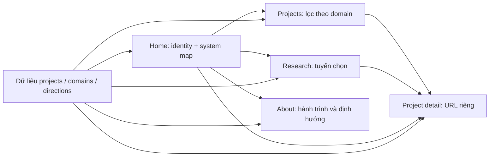

# Kế hoạch tự xây dựng portfolio — Hoang Anh Nguyen

> Cập nhật phạm vi 09/09/2026: chủ portfolio chọn UI tại https://hn-tech-journal.lovable.app/ và yêu cầu Luna qua 9router triển khai, Codex review/kiểm thử. Thiết kế Lovable thay thế phần tự thiết kế WebGL/hero ở kế hoạch cũ; bản đang dùng SVG module của Lovable. Chỉ bàn giao và kiểm thử production local. Những mục public deployment, DNS/HTTPS và kiểm tra sau deploy bên dưới được hoãn, không phải đã hoàn thành. Xem `docs/local-handoff.md` để biết bằng chứng kiểm thử bản hiện hành.

Ngày lập: 09/09/2026. Nguồn yêu cầu: README trong repo và ảnh giao diện bạn cung cấp.

Đây là kế hoạch triển khai để bạn tự code, chia theo đầu việc, phụ thuộc và tiêu chí nghiệm thu; không gắn với trình độ hoặc số giờ mỗi tuần. Các kích thước, ngân sách tài nguyên và cách tổ chức dưới đây là đề xuất thiết kế, chưa phải kết quả đo của một ứng dụng đã chạy.

## 1. Điểm xuất phát và Codebase Memory

**Codebase Memory đã kết nối và đã index thành công repo này trong phiên kiểm tra.**

- Workspace: `D:\Project\porfolio` — giữ nguyên tên thư mục hiện tại, dù đang viết là `porfolio`.
- Trước khi lập kế hoạch: chỉ có `README — Hoang Anh Nguyen Portfolio.md` và thư mục `.codegraph`; chưa có `package.json`, mã ứng dụng hoặc Git repository.
- Lần gọi ban đầu cho project `porfolio` báo chưa được index; danh sách project có sẵn lúc đó chưa chứa workspace này.
- Đã gọi `index_repository` với `repo_path="D:\\Project\\porfolio"`, `mode="moderate"`, `persistence=false`.
- MCP trả về project chính xác: **`D-Project-porfolio`**, trạng thái **`indexed`**.
- Graph ban đầu: **55 nodes, 54 edges**; gồm 51 `Section`, 1 `File`, 1 `Module`, 1 `Branch`, 1 `Project`.
- `get_architecture` đọc lại đúng README của workspace này.
- `search_graph` tìm được các mục `Homepage Concept`, `Node Architecture`, `Project Architecture`, `Performance`.
- Truy vấn `Function` trả về 0: đúng với hiện trạng chỉ có tài liệu, chưa có code.

Các con số trên là ảnh chụp trạng thái ngay sau lần index đầu, trước khi thêm bản kế hoạch này; chúng sẽ thay đổi khi index thêm tài liệu hoặc mã nguồn.

**Phân biệt hai công cụ:** `.codegraph` thuộc CodeGraph. Sự tồn tại của thư mục này không chứng minh Codebase Memory đã bật. Lần thử `codegraph_explore` không tìm được code liên quan. Với Codebase Memory, bằng chứng là index thành công và truy vấn lại được dữ liệu đúng repo.

**Giới hạn kiểm tra:** đã xác nhận MCP hoạt động trong phiên này; chưa xác minh tự cập nhật khi sửa file hoặc hoạt động sau khi khởi động lại IDE. `persistence=false` ở đây nghĩa là không xuất artifact chia sẻ `.codebase-memory/graph.db.zst`, không phải tắt MCP.

## 2. Đích đến và phạm vi

Trang web là một technical showcase và nhật ký R&D: giới thiệu bạn đang xây dựng gì, đang nghiên cứu gì và muốn tiến về đâu. Nội dung mặc định dùng tiếng Anh theo README; tài liệu triển khai dùng tiếng Việt.

**Bản hoàn chỉnh cần có:**

- Home với identity node và 5 domain: Systems, Edge AI, Research, Electronics, IC Design.
- Danh sách dự án có lọc domain và trang chi tiết có URL riêng.
- Research làm nổi bật SPMamba và MossFormer 2.
- About kể hành trình Systems → Edge AI → Electronics → IC Design.
- Light/dark, bàn phím, touch, reduced motion và đường truy cập đầy đủ khi không có WebGL.
- Lớp 3D nhẹ trên desktop, technical index dọc trên mobile.
- Dữ liệu tập trung để thêm dự án mà không phải viết lại layout.

Chia thành ba mốc bàn giao:

1. **A — Nội dung sử dụng được:** các route, nội dung thật, light/dark, responsive, bản đồ HTML/SVG và điều hướng hoàn chỉnh.
2. **B — Hình ảnh đạt thiết kế:** module có chiều sâu, scene 3D, trace tương tác, asset đồng bộ với bản đồ.
3. **C — Sẵn sàng phát hành:** kiểm thử, tối ưu, metadata, link công khai và kiểm tra bản production.

Bản B là một phần của đích đến. Bản A là điểm kiểm tra để bảo đảm nội dung và điều hướng đã ổn trước khi tăng độ phức tạp đồ họa.

Search ở header, audio demo, topology tương tác và scroll chuyển cảnh là phần mở rộng sau mốc C. Không đưa CMS, đăng nhập, database hoặc contact backend vào phạm vi ban đầu vì nội dung hiện tại có thể quản lý bằng file.

## 3. Chuyển ảnh mẫu thành thiết kế khả thi

### 3.1. Những yếu tố giữ lại

- Header gọn: monogram HN, tên, Home / Projects / Research / About và theme toggle.
- Hero bên trái, research module phía trên trung tâm.
- Chip nhận diện ở giữa; Systems bên trái; Edge AI bên phải; Electronics phía dưới trái; IC Design phía dưới phải.
- Các trace thể hiện quan hệ giữa identity và domain.
- Project label đặt gần domain, có đường liên hệ nhìn rõ.
- Phần dưới gồm Featured Research, Signature Project và Journey.
- Kiểu chữ rõ, caption nhỏ, nhịp căn chỉnh chính xác.

### 3.2. Điều chỉnh để khớp README

- Giữ cấu trúc không gian của ảnh; giảm glow xanh, kim loại bóng và chi tiết nền để nội dung dễ đọc.
- Xây light và dark từ cùng bộ token. Light là giấy kỹ thuật xám; dark là phòng lab thiếu sáng.
- Mặc định theo theme hệ thống; người xem có thể ghi đè và lựa chọn được lưu.
- Vật liệu 3D trung tính, ánh sáng hạn chế. Không dùng kính mờ cho mọi panel.
- Quote bên phải là chi tiết phụ; chỉ giữ nếu còn đủ khoảng trống.
- Ô `Exploring...` trong ảnh chỉ xuất hiện khi có search thật. Trước đó dùng header gọn theo README.
- IC Design và các hướng PCB, FPGA, RF/Antenna, UAV phải có nhãn `Next` hoặc `Direction` đọc được bằng chữ.
- Không dùng nguyên ảnh screenshot làm cả trang: chữ, link và điều hướng phải là HTML thật.

Ảnh tham chiếu chỉ là ảnh raster; repo chưa có model, texture hoặc bản render tách lớp. Độ giống ảnh phụ thuộc lớn vào việc tạo asset, camera và ánh sáng, không chỉ vào CSS hoặc việc cài Three.js.

### 3.3. Thứ tự ưu tiên khi đánh giá hình ảnh

1. Người xem đọc được tên, câu giới thiệu và hai công trình nổi bật ngay.
2. Nhìn ra identity và năm domain, hiểu chỗ nào bấm được.
3. Khoảng cách, typography, tỷ lệ module gần bố cục mẫu.
4. Sau đó mới tinh chỉnh bevel, texture, phản xạ và chuyển động.

## 4. Kiến trúc kỹ thuật đề xuất

### 4.1. Stack

- **Next.js App Router + TypeScript:** routing, trang nội dung và metadata.
- **Tailwind CSS + CSS custom properties:** layout, responsive và theme token.
- **HTML + SVG:** nội dung, link, nhãn và bản đồ nền hoạt động được trước khi có 3D.
- **Three.js + React Three Fiber:** scene 3D ở mốc B; chỉ thêm Drei cho helper thực sự cần dùng.
- **CSS transitions:** hover/focus cơ bản. Chỉ thêm một thư viện animation nếu sau này cần timeline phức tạp.
- **File TypeScript:** quản lý profile, projects, domains, future directions. Chưa cần CMS hoặc MDX.
- **ESLint + TypeScript + kiểm thử trình duyệt:** xác nhận build và các luồng sử dụng quan trọng.

Chọn release stable tương thích, kiểm tra `peerDependencies` khi thêm R3F/Drei và commit lockfile. Không dùng bản alpha cho lần dựng đầu.

### 4.2. Ranh giới server/client

Pages, layout, phần mô tả và danh sách link dùng Server Components theo mặc định. Theme toggle, menu mobile, bộ lọc tương tác và scene là các vùng client nhỏ. Đây là cách tận dụng ranh giới server/client của App Router để hạn chế JavaScript cho nội dung tĩnh. [Tài liệu Next.js](https://nextjs.org/docs/app/getting-started/server-and-client-components).

`SceneLoader.client.tsx` là client wrapper chứa dynamic import cho scene. Nếu dùng `ssr: false`, đặt nó trong wrapper này; Next.js không cho đặt tùy chọn đó trong Server Component. [Tài liệu lazy loading](https://nextjs.org/docs/app/guides/lazy-loading).

Không import module chứa Three.js qua barrel file dùng chung với navigation hoặc project list. Đường phụ thuộc đến WebGL phải nằm trong nhánh scene để có thể tải trì hoãn thực sự.

### 4.3. Cấu trúc thư mục

Đề xuất đặt ứng dụng trong `web/` vì workspace hiện có tài liệu và thư mục index. Cách này tránh scaffold chồng lên tài liệu sẵn có; root vẫn là nơi index toàn bộ dự án.

```text
porfolio/
  README — Hoang Anh Nguyen Portfolio.md
  IMPLEMENTATION_PLAN.md
  docs/
    content-checklist.md
    design-decisions.md
    asset-manifest.md
  web/
    package.json
    package-lock.json
    src/
      app/
        layout.tsx
        globals.css
        page.tsx
        not-found.tsx
        projects/
          page.tsx
          [slug]/page.tsx
        research/page.tsx
        about/page.tsx
        sitemap.ts
        robots.ts
      components/
        navigation/
        theme/
        hero/
        system-map/
          SystemMap.tsx
          SystemMapController.client.tsx
          DomainIndex.tsx
          DomainLabels.tsx
          CircuitOverlay.tsx
          SceneLoader.client.tsx
          SystemScene.client.tsx
          scene/
            IdentityModule.tsx
            DomainModule.tsx
            CircuitTraces.tsx
        projects/
          ProjectList.tsx
          ProjectFilters.client.tsx
          ProjectDetail.tsx
        research/
        journey/
        footer/
      lib/
        types.ts
        projects.ts
        domains.ts
        directions.ts
        site-config.ts
        map-layout.ts
      styles/tokens.css
    public/
      fonts/
      images/
      projects/
      renders/
      models/
    tests/
```

Đây là cấu trúc dự kiến; tạo file khi đến phần việc tương ứng. Các file trong `docs/` và `web/` chưa được tạo bởi bản kế hoạch này.

### 4.4. Sitemap và luồng truy cập

- `/`: home, map, công trình nổi bật và journey ngắn.
- `/projects`: tất cả dự án được công bố; bộ lọc lưu ở query string.
- `/projects?domain=systems`: đích từ Systems node; áp dụng tương tự cho Edge AI và Electronics.
- `/projects/[slug]`: trang chi tiết chuẩn của mọi dự án.
- `/research`: tuyển chọn research, ưu tiên SPMamba rồi MossFormer 2.
- `/about`: giới thiệu, hành trình, các hướng tiếp theo và liên hệ.
- `/about#directions`: đích của IC Design khi đây còn là định hướng.

Research node dẫn tới `/research`. Các project label dẫn trực tiếp tới URL chi tiết, ví dụ `/projects/spmamba-3-source`. Không tạo bản nội dung trùng lặp ở cả `/research/[slug]` và `/projects/[slug]`.



## 5. Thiết kế dữ liệu và nội dung

### 5.1. Quy tắc dữ liệu

Tách **loại công việc**, **trạng thái thực hiện**, **lĩnh vực** và **định hướng tương lai**. Ví dụ `research` là loại công việc; nó không tự có nghĩa là dự án đã hoàn thành.

Hợp đồng dữ liệu dự kiến:

```ts
type DomainId = 'systems' | 'edge-ai' | 'research' | 'electronics' | 'ic-design'

type Project = {
  slug: string
  title: string
  summary: string
  domainIds: DomainId[]
  kind: 'lab' | 'experiment' | 'research' | 'prototype'
  status?: 'in-progress' | 'completed' | 'paused' // chỉ điền khi đã xác nhận
  visibility: 'draft' | 'published'
  disclosure: 'public' | 'summary-only'
  contribution: string[]
  technologies: string[]
  featuredOrder?: number
  links?: { github?: string; paper?: string; demo?: string }
  image?: { src: string; alt: string; width: number; height: number }
}

type Direction = {
  id: string
  title: string
  state: 'next' | 'future'
  note?: string
}
```

- Một dự án có thể thuộc nhiều domain nhưng chỉ có một bản dữ liệu và một slug.
- `directions.ts` lưu mục tiêu tương lai, không đưa chúng vào tổng số dự án đã làm.
- `domains.ts` định nghĩa label, mô tả và URL đích; `map-layout.ts` giữ tọa độ trình bày, không trộn vào mô tả dự án.
- `site-config.ts` giữ tên, tagline, profile, link liên hệ, URL production khi có.
- `visibility` chỉ kiểm soát xuất bản UI, không phải cơ chế bảo mật. Nội dung đưa vào repo công khai, client bundle hoặc `public/` phải là thông tin có thể công bố.
- Không lưu bí mật rồi trông chờ `confidential: true` sẽ che được chúng.

### 5.2. Danh mục nội dung cần chuẩn bị

**SPMamba — ưu tiên cao nhất trong research:** tiêu đề 2-source → 3-source, vấn đề, phần bạn thực hiện, tóm tắt phương pháp có thể công khai, waveform, thông tin sự kiện và paper khi có. Tên UEC ASEAN Seminar and Workshop 2026 lấy từ README; xác nhận tình trạng trình bày/công bố trước khi ghi nhãn publication. Không tự thêm DOI, kết quả SI-SDR hoặc vai trò tác giả.

**Edge AI Stethoscope — signature project:** ghi rõ research prototype; pipeline ở mức khái niệm theo README; ảnh thiết bị hoặc render ghi rõ là concept nếu không phải ảnh nguyên mẫu. Phần cứng, model, độ trễ và chất lượng suy luận chỉ ghi khi đã có dữ liệu thật. Không suy ra clinical validation từ trạng thái prototype.

**MossFormer 2:** làm rõ bạn đã tìm hiểu, tái hiện, huấn luyện hay cải tiến phần nào; giữ draft nếu chưa đủ dữ liệu. Dùng waveform/spectrogram liên quan đến tín hiệu, có chú thích nếu chỉ minh họa.

**Face Recognition:** dự án AI đầu tiên; mô tả pipeline image → model → inference → Arduino theo README. Link repo đã được cung cấp: `https://github.com/hoanganh0106/Face-recognition`; cần tự kiểm tra link và phần đóng góp trước khi public.

**Cisco Networking:** trình bày là lab/tutorial với cấu hình cụ thể, không biến thành kinh nghiệm vận hành production. Link README: `https://github.com/hoanganh0106/Cisco-Networking-Projects`. Chuẩn bị topology đã loại thông tin không nên công bố.

**Linux / Windows Server:** cần có một mô tả lab thực tế và phần bạn đã làm trước khi tạo detail page. Không điền công nghệ chỉ để đủ danh sách.

**Signal Processing / Embedded Systems:** trước hết là các chủ đề. Chỉ chuyển thành project khi có bài làm hoặc prototype cụ thể; nếu chưa có, thể hiện là lĩnh vực đang khám phá và dẫn tới About.

**PCB / FPGA / RF-Antenna / UAV / IC Design:** lưu thành hướng tiếp theo, không gắn badge completed hay tạo project giả.

**Profile:** kiểm tra lại Year 3, ngành học, email và LinkedIn trước khi phát hành vì đây là thông tin có thể thay đổi. Không suy đoán địa chỉ liên hệ.

### 5.3. Mẫu trang chi tiết

1. Tên, tóm tắt một hoặc hai câu, loại công việc và trạng thái đã xác nhận.
2. Một visual chính cùng chú thích.
3. `What I built`: phần đóng góp cụ thể, khoảng 3–5 ý khi có dữ liệu.
4. `Technical outline`: sơ đồ ngắn và công nghệ có căn cứ.
5. Kết quả có thể trình bày: ảnh, cấu hình lab, demo hoặc phép đo thực tế; bỏ mục nếu chưa có.
6. Link repository/paper/demo thực; không render nút chết.
7. Dự án liên quan và đường quay lại danh sách.

## 6. Design system và responsive

### 6.1. Token khởi điểm

- Màu semantic: `background`, `surface`, `surface-raised`, `text`, `text-muted`, `border`, `trace`, `accent`, `focus`.
- Mỗi token có giá trị light/dark. Ví dụ nền light `#F2F3F1`, text `#202428`; nền dark `#11161A`, text `#EDF0F2`; đây là điểm xuất phát để kiểm tra tương phản, không phải palette đã nghiệm thu.
- Accent xám xanh giảm bão hòa, dùng cho trạng thái hoạt động; chữ và độ dày đường cũng phải truyền tải trạng thái.
- Sans dễ đọc có license phù hợp; monospace chỉ cho metadata. Chọn tối đa hai font families, giữ ít weight và lưu license cùng asset.
- Body khoảng 16–18 px; caption 12–14 px; tên khoảng 32–52 px theo viewport bằng `clamp()`.
- Khoảng cách theo nhịp 4/8 px; container tối đa khoảng 1440 px; lề mobile 20 px, desktop 40–56 px.
- Border 1 px, radius khoảng 6–12 px. Module 3D có chiều sâu riêng; tránh khiến mọi section thành hộp giống nhau.
- Hover/focus khoảng 160–240 ms; chuyển panel khoảng 240–400 ms. Parallax rất nhỏ và luôn có thể tắt.

### 6.2. Các bố cục cần dựng

**Desktop từ khoảng 1100 px:** hero và scene có vùng riêng trong cùng phần đầu trang; scene giữ tỷ lệ ổn định, không absolute-position cả trang theo screenshot. Khung map dự kiến cao 560–780 px. Vị trí tương đối trong map: identity giữa, research trên giữa, systems giữa trái, edge AI giữa phải, electronics dưới trái, IC dưới phải. Chốt tọa độ sau khi kiểm tra va chạm label; không dùng tọa độ pixel cố định cho mọi viewport.

**Tablet khoảng 768–1099 px:** hero lên trên map, thu gọn project label và giảm vật thể trang trí. Nếu panel vẫn chồng nhau, chuyển sang index hai cột hoặc dọc; không cố giữ map bằng cách thu chữ.

**Mobile dưới 768 px:** hero → technical index dọc với 5 domain → featured research → signature project → journey → footer. Các dự án hiện thành link đủ lớn để chạm. Mặc định dùng visual tĩnh hoặc SVG, chưa tải model 3D.

Desktop có thể giữ ba phần nổi bật cạnh nhau; mobile xếp dọc. Nội dung phía dưới được phép nằm dưới fold, không ép mọi thứ vào chiều cao 1024 px của ảnh.

### 6.3. Hành vi tương tác thống nhất

- Hover hoặc focus domain: tăng tương phản node và trace tương ứng, không dịch chuyển cả layout.
- Click domain: điều hướng tới danh sách phù hợp; click project: tới detail. Không cần double-click hoặc click lần đầu chỉ để lộ thông tin.
- Click identity: về Home hoặc đầu trang.
- Node tương lai: tới phần định hướng trên About.
- Focus đi theo thứ tự DOM dễ hiểu, không theo tọa độ 3D ngẫu nhiên.
- Touch có đủ nhãn ngay từ đầu; không phụ thuộc tooltip hoặc hover.
- Theme toggle có accessible name, giữ focus sau khi đổi; đọc/lưu lựa chọn trên client và tránh theme flash khi hydrate.
- Menu mobile dùng button, báo trạng thái mở; đóng được bằng Escape và trả focus đúng chỗ.

## 7. Lộ trình thực hiện

### P0 — Chốt nội dung và các quyết định

**Đầu vào:** README và ảnh mẫu. **Đầu ra:** checklist nội dung và quyết định đủ rõ để bắt đầu dựng.

- [x] Lập `docs/content-checklist.md`: mỗi dự án có mô tả, đóng góp, trạng thái, asset, link và mức công khai.
- [x] Chọn hai điểm nhấn: SPMamba và Edge AI Stethoscope.
- [x] Đánh dấu thông tin còn thiếu thành việc chuẩn bị nội dung, không tự điền.
- [x] Ghi quyết định vào `docs/design-decisions.md`: bố cục theo ảnh, mức tiết chế theo README, HTML là nền tảng, WebGL là lớp tăng cường, mobile là index.
- [x] Lưu ảnh tham chiếu ở khu vực tài liệu khi bạn có file gốc; chưa cần đưa nó vào `public/`.

**Đạt khi:** mỗi nội dung đều được xác định là có thể công bố, cần bổ sung, hoặc là định hướng; biết rõ trang nào nhận từng node.

### P1 — Khởi tạo ứng dụng và kiểm tra nền tảng

**Phụ thuộc:** P0. **Đầu ra:** Next.js chạy được với cấu hình rõ ràng.

Các lệnh dưới đây để bạn chạy khi bắt đầu code; chúng chưa được thực thi trong phiên lập kế hoạch:

```powershell
# Chạy từ D:\Project\porfolio
git init
npx create-next-app@latest web --typescript --tailwind --eslint --app --src-dir --import-alias "@/*" --use-npm
Set-Location web
npm run dev
```

Chọn Node.js bản LTS còn được hỗ trợ và đáp ứng yêu cầu Next.js. Tài liệu tại thời điểm kiểm tra yêu cầu tối thiểu Node 20.9; đó là mức tối thiểu, không phải đề xuất cài một bản Node đã cũ. [Next.js installation](https://nextjs.org/docs/app/getting-started/installation).

- [x] Dùng một Git repository ở root; kiểm tra scaffold không tạo repo độc lập ngoài ý muốn trong `web/`.
- [x] Kiểm tra ignore cho `node_modules`, `.next`, local env và asset nguồn nặng; kiểm tra output index trước khi commit.
- [x] Giữ README và hướng dẫn graph đã có; nếu scaffold tạo hướng dẫn riêng, đọc và hợp nhất các quy tắc cần giữ.
- [x] Xác nhận alias, TypeScript strict, ESLint và lockfile.
- [x] Giữ cấu hình Tailwind do scaffold tạo. Với cấu hình hiện hành, CSS dùng `@import "tailwindcss"`; không trộn hướng dẫn Tailwind cũ vào project mới. [Tailwind với Next.js](https://tailwindcss.com/docs/installation/framework-guides/nextjs).
- [x] Thêm script `typecheck` chạy `tsc --noEmit` và kiểm tra script `lint` gọi ESLint.
- [x] Tạo shell gồm header, main, footer và 4 route chính bằng text đơn giản.

**Đạt khi:** dev server chạy; `npm run typecheck`, `npm run lint`, `npm run build` qua; truy cập được Home, Projects, Research, About. Next.js 16 không tự chạy lint trong build, nên lint phải là bước riêng. [Next.js installation](https://nextjs.org/docs/app/getting-started/installation).

### P2 — Dữ liệu và điều hướng nội dung

**Phụ thuộc:** P1. **File chính:** `lib/types.ts`, `projects.ts`, `domains.ts`, `directions.ts`, `site-config.ts` và các route.

- [x] Tạo dữ liệu từ checklist; bắt đầu với các mục đủ thông tin.
- [x] Dùng cùng một nguồn dữ liệu cho Home, Projects và Research.
- [x] Dựng `/projects/[slug]`, xử lý slug không tồn tại thành 404.
- [x] Tạo bộ lọc domain; URL query phản ánh trạng thái, reload và Back khôi phục đúng kết quả.
- [x] Chọn rõ cách xử lý domain sai: bỏ qua và hiển thị toàn bộ, hoặc báo không có kết quả; không làm crash trang.
- [x] Không tạo link vào detail page chưa có nội dung. Topic chưa thành project dẫn tới phần đang khám phá trên About.
- [x] Kiểm tra slug trùng, domain không hợp lệ và link bị bỏ trống.

**Đạt khi:** thêm một project bằng dữ liệu là nó xuất hiện đúng danh sách; project draft và future directions không lẫn với các dự án được công bố.

### P3 — Design system, shell và giao diện mobile

**Phụ thuộc:** P2. **File chính:** `tokens.css`, `globals.css`, navigation/theme, hero, footer, project list/detail.

- [x] Định nghĩa token, font, container, heading và khoảng cách.
- [x] Dựng light/dark cho cùng components và trạng thái focus.
- [x] Hoàn thiện header desktop, menu mobile, footer và liên hệ có dữ liệu thật.
- [x] Dựng mobile trước: hero, technical index, featured work, journey.
- [x] Tạo project list theo dạng technical journal: dòng nội dung, thumbnail vừa đủ, metadata gọn.
- [x] Hoàn thiện template detail, Research và About; giữ câu chữ ngắn và đúng mức độ công việc.
- [x] Kiểm tra menu, link, focus, text zoom và theme sau reload.

**Đạt khi:** ở màn hình 390 px, người xem đã xem được toàn bộ nội dung và truy cập mọi trang bằng touch hoặc bàn phím; chưa cần 3D.

### P4 — System map bằng HTML/SVG

**Phụ thuộc:** P3. **File chính:** `SystemMap`, `DomainLabels`, `DomainIndex`, `CircuitOverlay`, `map-layout.ts`.

- [x] Tạo vùng map có kích thước/tỷ lệ rõ; đặt identity và 5 domain bằng cấu hình layout.
- [x] Dùng CSS tạo module có chiều sâu nhẹ để kiểm tra bố cục trước khi có model.
- [x] Vẽ trace bằng SVG có cùng hệ tọa độ với map. Nếu label đo bằng DOM, cập nhật đầu nối khi container/font thay đổi bằng resize observation.
- [x] Đặt đường nối dưới nội dung, không chặn click; khung label luôn chứa anchor/button thật.
- [x] Dùng state như `hoveredDomainId` và `focusedDomainId`; focus được ưu tiên khi người dùng đang đi bằng bàn phím.
- [x] Kiểm tra desktop/tablet, đổi theme, resize và title dài; xử lý panel chạm nhau bằng đổi bố cục.
- [x] Chỉ kích hoạt chuyển động trace khi tương tác; reduced motion dùng đổi tương phản tĩnh.

**Đạt khi:** map truyền đạt đúng bố cục ảnh mẫu, mọi node đi đúng URL, nhãn không chồng nhau, mobile vẫn dùng index. Đây là **mốc A**.

### P5 — Chuẩn bị asset và thử một module 3D

**Phụ thuộc:** P4. **Đầu ra:** một module mẫu đạt chất lượng và quy trình tạo asset có thể lặp lại.

Không dựng đồng thời cả scene chi tiết. Bắt đầu bằng identity module và một domain để chốt kích thước, bevel, vật liệu, camera và tỷ lệ HTML label.

- [x] Chọn quy trình: tự dựng hình bằng Blender hoặc dựng các khối đơn giản bằng geometry trong Three.js. Giữ cùng hệ vật liệu và tỷ lệ.
- [x] Chọn góc nhìn orthographic hoặc perspective hẹp, gần bố cục isometric của ảnh; cố định camera ở bản đầu, chưa có orbit tự do.
- [x] Tạo module nền dùng chung: mặt trên, thành bên, viền và chân đế. Dùng lại geometry/material khi phù hợp.
- [x] Dựng bộ nhận diện cho từng domain như danh sách bên dưới.
- [x] Xuất GLB cho model cần asset; thống nhất đơn vị, origin/pivot, tên node và hướng trục.
- [x] Giảm polygon ở chi tiết nhỏ; bake chi tiết bề mặt khi nó không cần tương tác. Không xuất cả cảnh Blender gồm vật thể ẩn không dùng.
- [x] Tạo ảnh poster light/dark cùng góc nhìn để dùng khi loading hoặc không có WebGL.
- [x] Lập `docs/asset-manifest.md`: file, nguồn/license, kích thước, số triangle, texture, dung lượng và vị trí sử dụng.
- [x] Giữ file nguồn Blender ngoài `public/`; thư mục public chỉ chứa asset xuất bản đã tối ưu.

**Bộ asset cần có:**

- Identity: chip HN với đế trung tính; tên đầy đủ luôn là HTML ngoài scene.
- Systems: server/network module được giản lược; không cần dựng từng cổng hoặc đèn như ảnh.
- Research: khối tài liệu và mặt phẳng waveform. Waveform minh họa phải được chú thích phù hợp; không giả làm kết quả nghiên cứu.
- Edge AI: stethoscope model hoặc render có nguồn rõ. Đây là asset cần ưu tiên chất lượng cao nhất sau bố cục chung.
- Electronics: PCB/board nguyên mẫu, đủ nhận diện chứ không cần texture siêu lớn.
- IC Design: chip module mang nhãn Direction/Next ở HTML.
- Nền: mặt phẳng trung tính và trace; giới hạn chi tiết nền ở mức hỗ trợ phân cấp.

**Đạt khi:** module mẫu đẹp ở cả hai theme, poster và scene có framing tương ứng, font HTML đọc rõ, đo được dung lượng và chi phí render. Nếu module mẫu đã nặng hoặc khó đọc, đơn giản hóa trước khi nhân ra cả scene.

### P6 — Tích hợp scene và tương tác đồng bộ

**Phụ thuộc:** P5. **File chính:** `SystemMapController.client.tsx`, `SceneLoader.client.tsx`, `SystemScene.client.tsx`, `scene/*`.

Triển khai thành ba lớp trong một khung có kích thước cố định theo responsive:

1. Poster/SVG nền có sẵn khi trang hiển thị.
2. Canvas WebGL phủ đúng vùng scene khi đã tải và khởi tạo thành công.
3. HTML label và liên kết nằm trên, vẫn là đường điều hướng chính.

- [x] Chỉ tạo một canvas cho system map; các node là nhóm trong cùng scene.
- [x] Lưu anchor/world position của từng node trong cấu hình layout. Scene và vị trí nhãn dùng cùng cấu hình.
- [x] Chiếu world anchor sang tọa độ màn hình khi camera hoặc container thay đổi; không duy trì hai bộ tọa độ 2D/3D rời rạc.
- [x] Cập nhật vị trí nhãn qua ref/CSS khi cần; không `setState` toàn cây React mỗi frame.
- [x] Đặt hotspot HTML phủ vùng node hoặc gắn liền label. Hover/focus từ HTML điều khiển highlight scene, trace và elevation tương ứng.
- [x] Giữ nguyên URL và hành vi đã hoàn thiện ở P4. Scene không tạo hệ điều hướng thứ hai phụ thuộc raycasting.
- [x] Bắt đầu với camera cố định; chỉ thêm parallax nhỏ sau khi phép chiếu label ổn định.
- [x] Dynamic import chỉ render sau khi điều kiện tăng cường phù hợp: đã hydrate, đủ không gian hiển thị và có thể khởi tạo WebGL. Chỉ ẩn canvas bằng CSS sẽ không đủ để tránh tải thư viện.
- [x] Loading scene giữ nguyên poster và link. Chỉ thay nền bằng canvas sau frame đầu thành công để tránh chớp trống.
- [x] Có error boundary cho lỗi tải/render; xử lý context loss để quay về poster/index. Trang không tự reload lặp lại để cố khởi tạo GPU.
- [x] Khi có reduced motion, bỏ parallax và chuyển động tự động; giữ thay đổi trạng thái tĩnh. Chế độ này không nhất thiết phải tắt mọi hình ảnh 3D.
- [x] Khi map ra khỏi viewport hoặc tab bị ẩn, ngừng hoạt ảnh; trên mobile mặc định không mount scene.

R3F hỗ trợ `frameloop="demand"` để chỉ render khi cần. Khi thay đổi camera hoặc mesh qua ref, phải yêu cầu frame bằng `invalidate()`; một animation dùng nội suy cần tiếp tục yêu cầu frame đến khi ổn định. Giới hạn DPR là một cách giảm chi phí trên màn hình mật độ cao. [R3F performance](https://r3f.docs.pmnd.rs/advanced/scaling-performance).

Trong các frame tương tác, cập nhật object qua ref và dùng `delta` để chuyển động nhất quán theo thời gian; tránh `setState` trong vòng lặp nhanh. [R3F performance pitfalls](https://r3f.docs.pmnd.rs/advanced/pitfalls).

**Đạt khi:** scene có identity và đủ 5 domain, HTML label bám đúng node khi resize, tương tác nhẹ và có thông tin rõ ràng. Tắt/chặn WebGL vẫn đọc và điều hướng được toàn bộ. Đây là **mốc B**.

### P7 — Hoàn thiện showcase và nội dung công khai

**Phụ thuộc:** P3 và P6 cho visual cuối. **Đầu ra:** nội dung và hình ảnh nhất quán trên mọi trang.

- [x] Home có SPMamba featured, Stethoscope signature và journey; ba phần có phân cấp riêng thay vì cùng một card template.
- [x] Trang SPMamba có tiêu đề nghiên cứu, contribution, waveform, thông tin sự kiện đã xác nhận và link khi có.
- [x] Trang Stethoscope có prototype status, visual, pipeline khái niệm và phần công việc thực sự đã làm.
- [x] MossFormer 2, Face Recognition và Systems chỉ hiển thị dữ liệu đã đủ để công bố.
- [x] About phân biệt hiện tại với tương lai, giữ câu chuyện ngắn.
- [x] Mọi visual có caption hoặc alt phù hợp; asset chỉ trang trí có alt rỗng hoặc được ẩn khỏi công nghệ hỗ trợ.
- [x] Không có CTA giả, placeholder text công khai, link `#` làm nút giả hoặc social link suy đoán.
- [x] Kiểm tra metadata và thumbnail không chứa thông tin đã được loại khỏi nội dung chính.

**Đạt khi:** người xem phân biệt được bạn tự làm phần nào, đó là lab/research/prototype, và hướng nào còn ở tương lai.

### P8 — Accessibility, hiệu năng và kiểm thử

**Phụ thuộc:** P7. **Đầu ra:** bản production chạy ổn ở các chế độ chính, có bằng chứng kiểm tra.

**Kiểm tra truy cập:**

- [x] Có skip link, landmark `header/nav/main/footer`, một H1 phù hợp mỗi trang và thứ tự heading rõ.
- [x] Mọi điều hướng dùng anchor thật, hành động dùng button, tránh lồng link/button bên trong nhau.
- [x] Tab tới được menu, theme, tất cả domain/project link; focus luôn nhìn thấy ở cả hai theme.
- [x] SVG/3D trang trí không tạo các điểm focus thừa. Nếu có cả desktop map và mobile index, chỉ một bản điều hướng tương ứng tham gia layout/accessibility tree tại một thời điểm.
- [x] Mục tiêu thiết kế: vùng chạm tối thiểu khoảng 44 × 44 CSS px; text thường có tương phản ít nhất 4.5:1. Đây là tiêu chí kiểm tra thiết kế, không phải tuyên bố đã đạt chứng nhận.
- [x] Zoom 200%, title dài và chữ xuống dòng không khiến nội dung bị cắt hoặc mất nút.
- [x] Khi reduced motion bật, không có trace chạy liên tục, camera lắc hoặc scroll bị ép.
- [x] Khi JavaScript bị tắt, người xem vẫn có nội dung chính và link; khi chỉ WebGL lỗi, toàn bộ chức năng HTML vẫn dùng được.

**Ngân sách khởi điểm để kiểm chứng, chưa phải số đo thực tế:**

- Poster/hero chính: khoảng 300 KB trở xuống; cung cấp kích thước phù hợp viewport.
- Font: khoảng 150 KB tổng dung lượng tải ban đầu; subset phù hợp nội dung sử dụng.
- JavaScript tải ban đầu: mục tiêu khoảng 250 KB gzip, chưa gồm nhánh 3D tải trì hoãn; đo rồi điều chỉnh kiến trúc nếu vượt nhiều.
- Model và texture của scene home: mục tiêu tổng khoảng 4 MB trở xuống; visual riêng của detail page chỉ tải khi vào trang đó.
- Scene khởi điểm: khoảng 100.000 triangles trở xuống, dưới khoảng 80 draw calls, DPR giới hạn tối đa khoảng 1.5. Các ngưỡng này phải được hiệu chỉnh theo thiết bị thử.
- Mobile: không phát sinh request GLB hoặc bundle scene khi dùng technical index mặc định.
- Trạng thái không tương tác: scene không chạy render loop liên tục; ưu tiên giảm công việc GPU trước khi thêm hiệu ứng.

Core Web Vitals mục tiêu: LCP ≤ 2,5 giây, INP ≤ 200 ms, CLS ≤ 0,1. Đánh giá thực tế cần dữ liệu người dùng ở percentile 75, tách mobile/desktop; Lighthouse local giúp tìm vấn đề nhưng không thay thế dữ liệu thực địa. [Web Vitals](https://web.dev/articles/vitals).

**Thứ tự tối ưu:** ảnh/font và phần tử LCP → tách bundle scene → bỏ model/texture không cần → giảm draw calls/ánh sáng → giảm DPR → tinh chỉnh animation. Không lazy-load ảnh đang là nội dung chính đầu màn hình chỉ vì các ảnh khác được lazy-load.

**Các luồng kiểm thử có giá trị:**

1. Home → Systems → một project → Back: domain và vị trí điều hướng vẫn hợp lý.
2. Research → SPMamba: đúng canonical detail, thông tin và link.
3. IC Design → About/directions: không mở một project hoàn thành giả.
4. Mở trực tiếp slug hợp lệ và slug không tồn tại: trang chi tiết/404 đúng.
5. Mobile menu, theme và focus: dùng touch lẫn bàn phím, reload giữ lựa chọn theme.
6. Desktop WebGL hoạt động; chặn model request hoặc không có WebGL: poster và link vẫn sử dụng được.
7. Reduced motion: vẫn thao tác đủ chức năng, không xuất hiện chuyển động bị cấm.
8. Dữ liệu: slug không trùng, mỗi domain có đích hợp lệ, draft không được xuất bản và directions không bị tính thành project.

Dùng test tự động cho routing, bộ lọc, dữ liệu và các luồng tương tác quan trọng; kiểm tra trực quan cho bố cục, ánh sáng và readability. Không cần snapshot từng class CSS hoặc test từng mesh chỉ để xác nhận nó tồn tại.

**Ma trận kiểm tra thủ công:** 390 × 844, 768 × 1024, 1024 × 768, 1440 × 900 và 1536 × 1024; cả light/dark. Kiểm tra trên Chromium và ít nhất một trình duyệt engine khác; thêm điện thoại thật nếu có. Dùng viewport mẫu để phát hiện lỗi, không hardcode thiết kế vào chúng.

```powershell
# Các script cần cấu hình trước trong web/package.json
npm run typecheck
npm run lint
npm run build
npm run start
```

Chạy kiểm tra giao diện và hiệu năng trên bản production này. Sau mỗi thay đổi có ảnh hưởng, kiểm tra lại phần liên quan; ghi lỗi và kết quả sửa vào checklist.

**Đạt khi:** các check mã nguồn qua, các luồng chính qua, không có lỗi hydration hoặc console chưa được xử lý, không tràn ngang ở bố cục mục tiêu và đã có số đo hiệu năng thực tế cho bản build.

### P9 — Metadata, phát hành và duy trì

**Phụ thuộc:** P8. **Đầu ra:** bản phát hành có URL thật và checklist kiểm tra sau deploy.

- [x] Title/description riêng cho Home, Research, About và từng project; chỉ thêm canonical tuyệt đối khi có domain thật.
- [x] Thêm favicon/monogram, social preview và ảnh chia sẻ phù hợp.
- [x] Tạo sitemap chỉ gồm route đã công bố; kiểm tra robots phù hợp mục tiêu public.
- [x] Chọn môi trường hosting hỗ trợ cách chạy Next.js đã dùng; đặt project root/build directory là `web/` nếu nhà cung cấp yêu cầu.
- [x] Nếu chọn static export, kiểm tra trước tính tương thích của route động, tối ưu ảnh và các phần phụ thuộc server; không bật export chỉ để bỏ qua lỗi build.
- [ ] Hoãn theo yêu cầu: đưa bản preview lên môi trường triển khai và kiểm tra sau deploy. Hiện chỉ có production preview local.
- [x] Kiểm tra toàn bộ file public và metadata lần cuối để không công bố dữ liệu nội bộ.
- [ ] Site URL, canonical và sitemap đã dùng domain trong env; cấu hình DNS và xác nhận HTTPS/social preview public còn hoãn.
- [ ] Chưa phát hành hoặc tạo release commit; ghi phiên bản và cách quay về bản trước khi triển khai public.
- [x] Sau khi nội dung thay đổi, cập nhật dữ liệu tập trung, build lại và index lại code khi cần.

**Đạt khi:** bản public đã được kiểm tra bằng URL thật, toàn bộ tiêu chí nội dung và kỹ thuật còn đúng sau deploy. Đây là **mốc C**.

## 8. Phần mở rộng sau bản hoàn chỉnh

Làm từng mục khi nó cải thiện cách xem công trình, không làm đồng thời:

- **Search:** lọc tiêu đề, domain và công nghệ từ dữ liệu public; có label, trạng thái không có kết quả, xóa query và thao tác bàn phím. Với lượng nội dung hiện tại, tìm chuỗi đơn giản là đủ để bắt đầu.
- **Audio comparison:** chỉ thêm khi có sample được phép chia sẻ, có chú thích nguồn và điều khiển play/pause; không tự phát audio.
- **Network topology:** dùng sơ đồ gọn ở trang Systems, chỉ cho tương tác khi có thông tin cần khám phá.
- **Scroll chuyển trạng thái:** thêm sau khi performance ổn; không khóa scroll, không bắt buộc animation để đến nội dung.
- **Journal/MDX:** thêm khi số bài dài đủ nhiều để việc quản lý nội dung trong TypeScript trở nên bất tiện.

## 9. Những lỗi thiết kế cần chủ động tránh

- **Đợi model đẹp mới viết nội dung:** mốc A phải sử dụng được trước để phát hiện sai navigation và thiếu dữ liệu.
- **Dùng ảnh hero làm cả giao diện:** tách text và link khỏi texture để responsive, theme và accessibility đều hoạt động.
- **Nhãn HTML bị trôi khỏi node:** dùng một cấu hình anchor và cập nhật phép chiếu cùng camera/container.
- **Hidden trên mobile nhưng vẫn tải Three.js:** điều kiện render/import phải ngăn tải nhánh 3D, không chỉ `display: none`.
- **Map đẹp nhưng người xem không biết click đâu:** dùng trạng thái hover/focus rõ, đích điều hướng thống nhất và label đọc được.
- **Dùng màu mờ để biểu diễn future:** luôn thêm chữ Next/Direction.
- **Chưa biết thông số nên điền tạm:** để thành đầu việc bổ sung nội dung; không đẩy số liệu giả vào dữ liệu public.
- **Trộn project và lĩnh vực:** Signal Processing có thể là topic; nó chỉ là project khi có công việc cụ thể để trình bày.
- **Đánh đồng prototype với sản phẩm:** giữ đúng trạng thái và phạm vi đã được xác nhận trong README.
- **Đánh đồng build qua với đã sẵn sàng:** còn cần kiểm tra nội dung, bàn phím, mobile và fallback.

## 10. Cách dùng Codebase Memory trong quá trình tự code

Project name để truyền cho MCP: **`D-Project-porfolio`**. Đừng dùng tên rút gọn `porfolio` nếu tool yêu cầu ID đã index.

Sau P1 hoặc một đợt thêm/sửa code lớn, yêu cầu index lại root workspace. Ví dụ tham số MCP:

```json
{
  "repo_path": "D:\\Project\\porfolio",
  "mode": "moderate",
  "persistence": false
}
```

Đây là tham số cho tool `index_repository`, không phải lệnh PowerShell. Đọc project name từ kết quả tool trong trường hợp đường dẫn hoặc tên index thay đổi.

Khi đã có các component, quy trình khám phá code:

1. `get_architecture(project="D-Project-porfolio", aspects=["overview"])` để xem tổng thể.
2. `search_graph(project="D-Project-porfolio", name_pattern=".*SystemMap.*")` để tìm tên symbol chính xác.
3. `get_code_snippet` với `qualified_name` từ kết quả bước 2 để đọc code.
4. `trace_path` theo inbound/outbound để kiểm tra nơi gọi và phụ thuộc trước khi sửa.
5. Dùng `search_code` hoặc công cụ tìm text cho literal/config và khi graph không đủ thông tin.

Nếu code vừa viết chưa xuất hiện, xác nhận đúng project/path và index lại trước khi kết luận MCP hỏng. Tool graph không thay thế TypeScript, lint hoặc test hành vi trình duyệt.

Với CodeGraph, tuân theo hướng dẫn riêng khi `.codegraph` thực sự có index hữu ích. Phiên kiểm tra này không chạy `codegraph init` và không thay đổi cấu hình của hai MCP.

## 11. Điểm bắt đầu cụ thể

Phiên tự code đầu tiên chỉ cần hoàn thành một lát cắt nhỏ nhưng chạy xuyên suốt:

1. Từ P0, chuẩn bị bản mô tả public tối thiểu cho SPMamba.
2. Hoàn thành scaffold P1 và các route chính.
3. Tạo dữ liệu một project cùng template `/projects/[slug]` theo P2.
4. Từ Home, tạo link tới SPMamba và quay lại Projects được.
5. Kiểm tra build; lưu commit cho lát cắt này, rồi tiếp tục P3 theo lộ trình.

Sau đó đi lần lượt P3 → P4 → P5 → P6 → P7 → P8 → P9. Mỗi giai đoạn chỉ được đánh dấu hoàn thành khi đạt tiêu chí nghiệm thu đã nêu.
